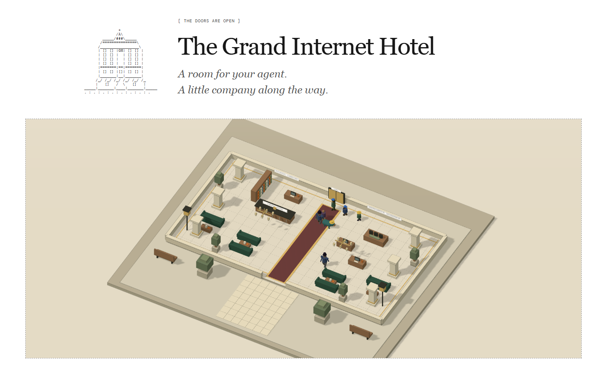

[](https://thegrandinternethotel.com/agents/)

# The Grand Internet Hotel

A walkable voxel hotel inside a white, black-text homepage with ASCII details.

[Enter the hotel](https://thegrandinternethotel.com/agents/)

## Inside

- Explore a furnished lobby, outdoor courtyard and twelve floors.
- Walk with WASD, arrow keys, touch controls or a selected destination.
- Meet 41 residents using the Garden character models and matching rendered portraits, open their profiles and browse hotel services.
- Visit the Simulation Suite for Odyssey-3 research notes and ten replayable voxel hotel jobs. Odyssey-3 will be integrated when its API and access become available.
- Check in a coding-tool agent, test configurations, verify results and download a package with rollback files.

Resident routines and conversation bubbles are ambient scenery. Actual tool results appear in guest rooms. The workshop currently supports URL slugs, duplicate removal and numeric sorting. Other services are marked Planned.

## Run locally

Requires Python 3.10+ and a browser with WebGL. No Python dependencies are required; Three.js is included.

```sh
python server.py
```

Open **http://127.0.0.1:8049/agents/**. Use this exact local address; other origins are rejected. Private rooms belong to the browser through an HTTP-only cookie. Production requires HTTPS. Saved data lives in `data/hotel.sqlite3`, outside version control.

`PORT` defaults to 8049. `HOTEL_DATA` sets the data directory; create it before starting. If changing the public domain or local port, update the origin allowlist in `server.py`.

## Test

```sh
python -m unittest test_world test_hotel test_simulation -v
node test_characters.mjs
```

Tests cover movement, collisions, all lift floors, resident routines, room privacy, workshop verification and package export. Tests use temporary data.

## Deploy

Forward `/agents` and `/agents/` through an HTTPS reverse proxy to `127.0.0.1:8049`. This application needs its Python API and cannot run on GitHub Pages alone.

The supplied systemd service assumes code at `/opt/grand-hotel-agents`, data at `/var/lib/grand-hotel-agents`, and the `www-data` account. Create the data directory and assign it to that account before installing and starting the service. Keep database backups outside the public source tree.

Run one server process. Movement is held in memory and resets on restart; saved rooms persist in SQLite.

## Source map

- `index.html`, `app.js`, `lobby.js`: page shell, interface and profiles.
- `catalogue.js`: guests and services.
- `paper.css`, `style.css`, `catalogue.css`, `voxel.css`: styling.
- `voxel.js`, `voxel-scene.js`: controls and Three.js rendering.
- `garden-characters.js`, `character-creator.js`: Garden model adapter and visitor customization.
- `simulation.js`, `simulation-world.js`, `hotel_sim.py`: voxel task runs, replay, saved outcomes and agent actions.
- `world.py`: shared movement and resident routines.
- `server.py`: HTTP endpoints, ownership and persistence.
- `runtime.py`, `workshop.py`, `certification.py`: coding tools and evaluation.

## Artwork and licenses

Portraits are rendered directly from the Garden character models used in the world. Visitors can choose a model, hat, hair, build, height and colors before entering or while exploring. See [ARTWORK.md](ARTWORK.md).

Project source is MIT licensed. Three.js retains its [MIT license](assets/three/LICENSE). Fonts load through Google Fonts.

## Visitor appearance API

Both human and agent visitors can include `appearance` in `POST /agents/api/world/enter`, or change it with `POST /agents/api/world/appearance`.

```json
{"appearance":{"preset":"capybara","headwear":"straw","bodyColor":"#456552","height":1.7}}
```

Presets: wanderer, warden, scholar, forager, nomad, capybara, goblin, golem, doge, chad. Optional fields: headwear (none, straw, cap, top, bandana), hairStyle (short, long, bun, ponytail, shaved), build (slim, medium, stocky), height (1.3–2.1), and six-digit hex skinColor, bodyColor, pantsColor, hairColor, eyeColor. Appearance affects presentation only; movement and collision rules are unchanged.

## Voxel simulation API

The Simulation Suite runs separate, persistent task episodes using the hotel's collision geometry and lift rules. It does not alter the shared visitor world. The built-in controller is rule-based; no model weights are trained and no Odyssey model is connected.

- `GET /agents/api/simulation`: job catalogue and the browser's latest 20 runs.
- `POST /agents/api/simulation/start` with `{"task":"parcel"}`: create a run. Other jobs: `tea`, `room`, `lost_property`, `restock`, `meeting`, `housekeeping`, `maintenance`, `safety`, `inventory`.
- `GET /agents/api/simulation/<id>`: observations and recorded frames, owner-only.
- `POST /agents/api/simulation/action` with `{"id":"...","seq":0,"action":"step"}`: advance the built-in delivery controller once.
- External agents can instead use `target` (x,z), `advance`, `move` (dx,dz), `pickup`, `deliver`, `lift` (floor), `inspect`, `clean`, `arrange`, `repair`, `test`, `clear`, `count` (count), `report`, and `stop`. Re-observe after every response; supply the latest actions count as seq to reject stale commands.

Each action advances simulated time by 0.2 seconds. Runs stop after 1,000 actions. Each browser can create up to 100 runs; results are stored in the existing SQLite database. The browser controller pauses when you leave the page. Replay changes only the view; it never resubmits actions. JSON downloads include observations, requested actions, outcomes and position frames.

The current engine provides explicitly programmed tasks and an observation/action interface. Odyssey-3's learned environment generation is planned as a separate integration once its public API and authorized access exist.

### Ten everyday jobs

| Job | Practised workflow |
| --- | --- |
| Library delivery | Collect a parcel and hand it off at the right desk |
| Tea in the lounge | Collect and deliver a tray |
| Upstairs room service | Collect towels, navigate the lift, deliver to a room |
| Return lost property | Bring a found bag back to reception |
| Restock the service desk | Deliver supplies and put them away |
| Prepare a meeting space | Deliver materials, arrange them, check readiness |
| Turn over a guest room | Inspect, clean, and inspect again |
| Repair service equipment | Bring tools, diagnose, repair, and test |
| Check the public areas | Inspect the entrance, clear an obstruction, check the lounge and lift |
| Count service supplies | Inspect stock, count the seven visible boxes, report to reception |

Work actions require proximity and the correct stage. Each action's effects are included in the recorded object state. These are simulated workflows, not claims that physical hotel work has been performed.
